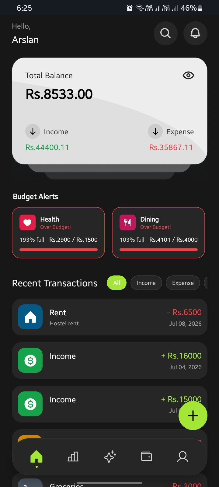
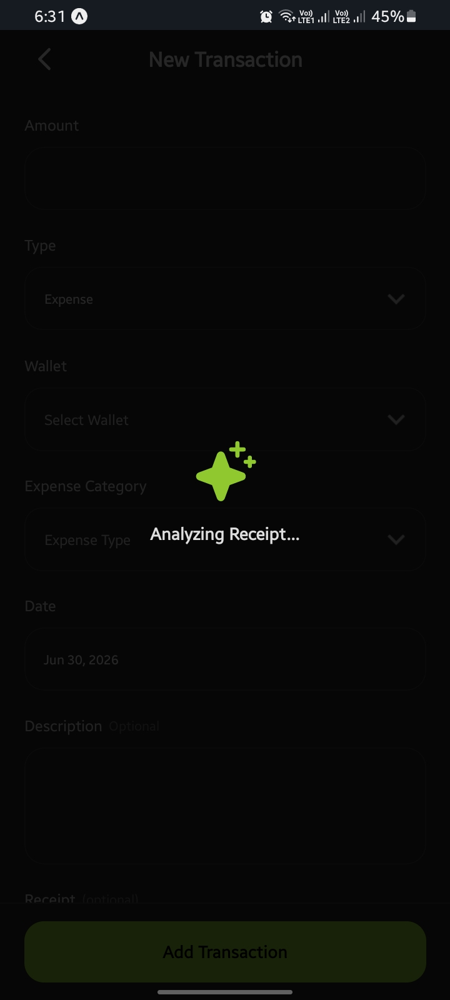
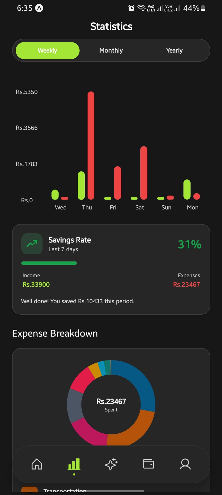
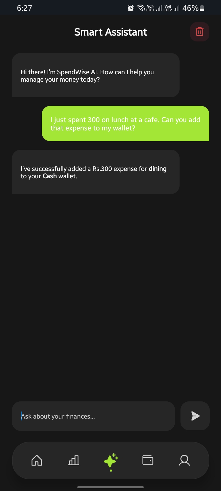
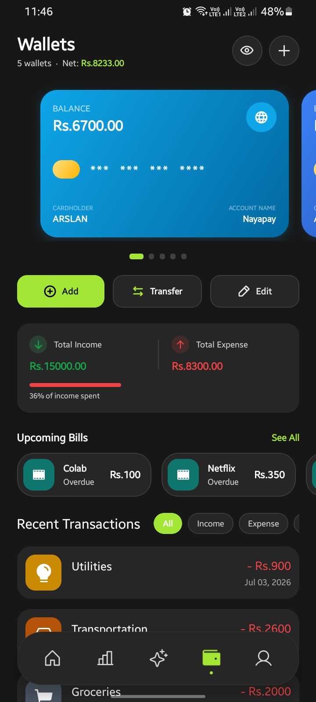
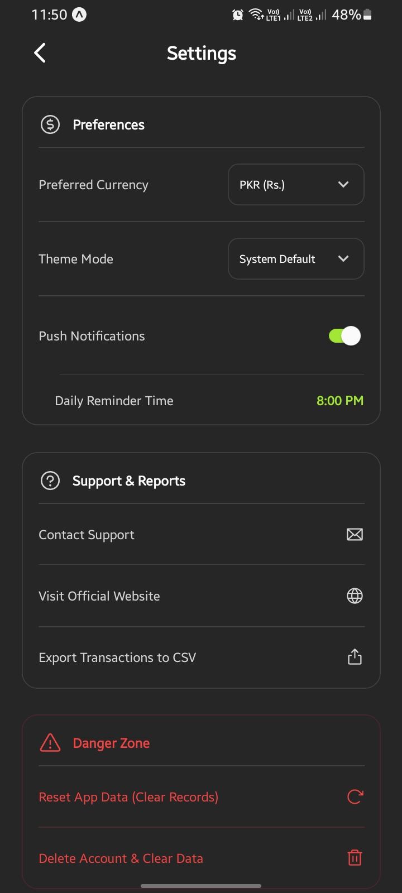

<div align="center">
  
  
  # SpendWise
  **The definitive AI-powered personal finance tracker.**
  
  [](https://spendwiseapp.tech)
  [](https://reactnative.dev/)
  [](https://expo.dev/)
  [](https://firebase.google.com/)

  <p align="center">
    SpendWise is a next-generation personal finance application built for Android and iOS. It combines robust expense tracking with cutting-edge Artificial Intelligence to automatically scan receipts and provide personalized financial advice.
  </p>
</div>

---

## Features

- **AI Receipt Scanner:** Simply snap a photo of a receipt. The AI (powered by Google Gemini and Groq) instantly extracts the merchant, total amount, and categorizes the transaction automatically.
- **AI Financial Advisor:** Chat with a dedicated AI assistant directly in the app to get personalized budgeting advice and insights into spending habits.
- **Advanced Analytics:** Interactive charts to visualize cash flow and spending trends over time.
- **Multi-Wallet Architecture:** Segregate funds into different wallets (Checking, Savings, Crypto, Cash) and track transfers between them.
- **Budget Tracking:** Create robust monthly budgets and easily view the remaining allowance per category.
- **Subscription Management:** Keep track of active subscriptions to ensure no surprise charges.
- **Dynamic Theming:** Seamless support for Light and Dark modes, heavily optimized for a gorgeous dark-mode experience.
- **Push Notifications:** Configurable daily reminders to keep tracking habits consistent.
- **CSV Export:** Instantly generate and share spreadsheet reports of financial history.
- **Enterprise-Grade Security:** Fully secured by Firebase Authentication and strict Firestore security rules.

## Screenshots

| Dashboard | AI Receipt Scanner | Analytics |
| :---: | :---: | :---: |
|  |  |  |

| AI Financial Chat | Wallets | Settings |
| :---: | :---: | :---: |
|  |  |  |

---

## Tech Stack

### Frontend & Mobile
- **React Native (0.76.5)** with **Expo (54.0)** for cross-platform compilation.
- **Expo Router (6.0)** for modern, file-based navigation.
- **TypeScript** for strict type-safety across the entire codebase.
- **React Native Gifted Charts** for data visualization.

### Backend & Cloud
- **Firebase Authentication:** Handles secure user onboarding (Email/Password and Google SSO).
- **Cloud Firestore:** Real-time NoSQL database for syncing transactions across devices instantly.
- **Cloudinary:** Blazing-fast CDN for storing user avatars and highly compressed receipt images.

### Artificial Intelligence
- **Google Gemini API:** Primary intelligence engine for processing images and chat logic.
- **Groq API:** Ultra-low latency fallback system for text generation.

---

## Getting Started

### Prerequisites
- Node.js (v18 or higher)
- Java Development Kit (JDK 21)
- Android Studio (for local compilation) or an Expo Go client.

### Installation

1. **Clone the repository:**
```bash
git clone https://github.com/mearslanahmed/SpendWise.git
cd SpendWise
```

2. **Install dependencies:**
```bash
npm install
```

3. **Configure Environment Variables:**
Create a `.env` file in the root directory and populate it with the specific API keys:
```env
EXPO_PUBLIC_FIREBASE_API_KEY=your_key
EXPO_PUBLIC_FIREBASE_AUTH_DOMAIN=your_domain
EXPO_PUBLIC_FIREBASE_PROJECT_ID=your_project
EXPO_PUBLIC_FIREBASE_STORAGE_BUCKET=your_bucket
EXPO_PUBLIC_FIREBASE_MESSAGING_SENDER_ID=your_id
EXPO_PUBLIC_FIREBASE_APP_ID=your_app_id
EXPO_PUBLIC_API_URL=https://spendwiseapp.tech/api
EXPO_PUBLIC_CLOUDINARY_CLOUD_NAME=your_cloud_name
EXPO_PUBLIC_CLOUDINARY_UPLOAD_PRESET=your_preset
```

4. **Run the Application:**
```bash
npx expo start
```

---

## Building for Production

### Android (APK / AAB)
To generate a standalone APK for Android, ensure the Android SDK is configured, then run:
```bash
cd android
./gradlew assembleRelease
```
*(The final .apk will be output to android/app/build/outputs/apk/release/)*

To build for the Google Play Store (AAB):
```bash
./gradlew bundleRelease
```

### iOS (IPA)
To build for iOS, a macOS machine with Xcode installed is required:
```bash
npx expo run:ios --configuration Release
```

*(Alternatively, build both platforms entirely in the cloud using Expo EAS: `eas build --profile production`)*

---

## Official Website
The official Next.js marketing and backend website for SpendWise is available at: 
**[https://spendwiseapp.tech](https://spendwiseapp.tech)**

## Developer & Contact

**Arslan Ahmed**
- Business & Freelance Inquiries: [arslanahmednaseem@gmail.com](mailto:arslanahmednaseem@gmail.com)
- App Support: [spendwiseoffical@gmail.com](mailto:spendwiseoffical@gmail.com)
- GitHub: [@mearslanahmed](https://github.com/mearslanahmed)

## Legal

SpendWise is a proprietary application. By downloading, accessing, or running this software, you agree to the Terms of Service and Privacy Policy.

- View the [LICENSE](LICENSE) file for distribution rights.
- The official web-hosted legal documents can be found at [spendwiseapp.tech/privacy](https://spendwiseapp.tech/privacy) and [spendwiseapp.tech/terms](https://spendwiseapp.tech/terms).
