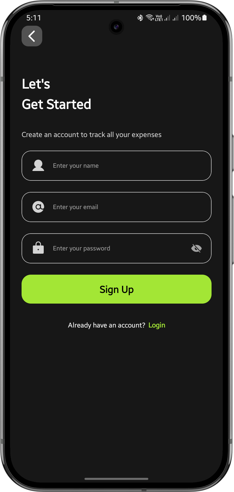
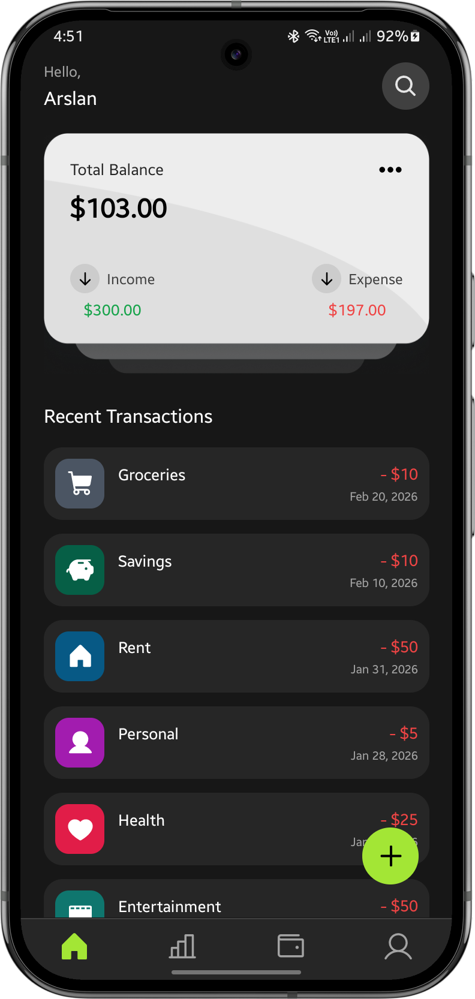
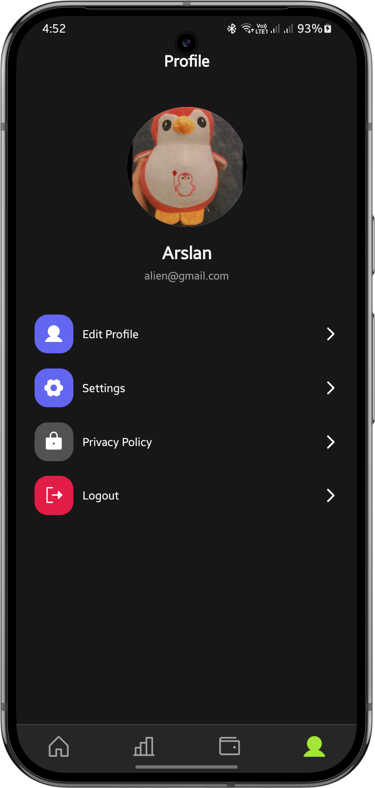
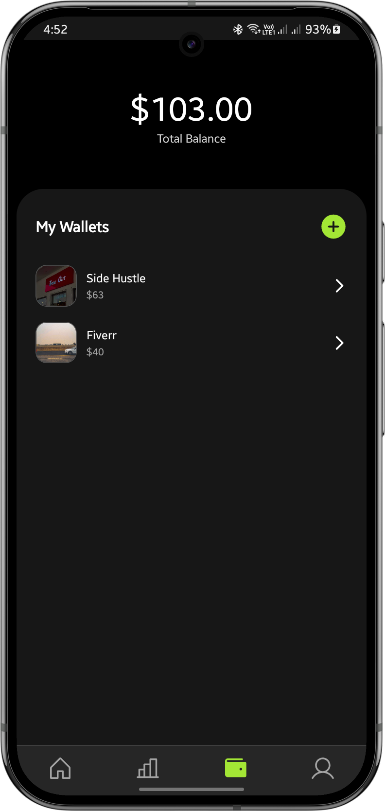
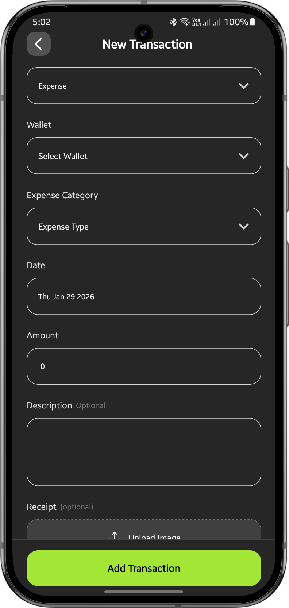
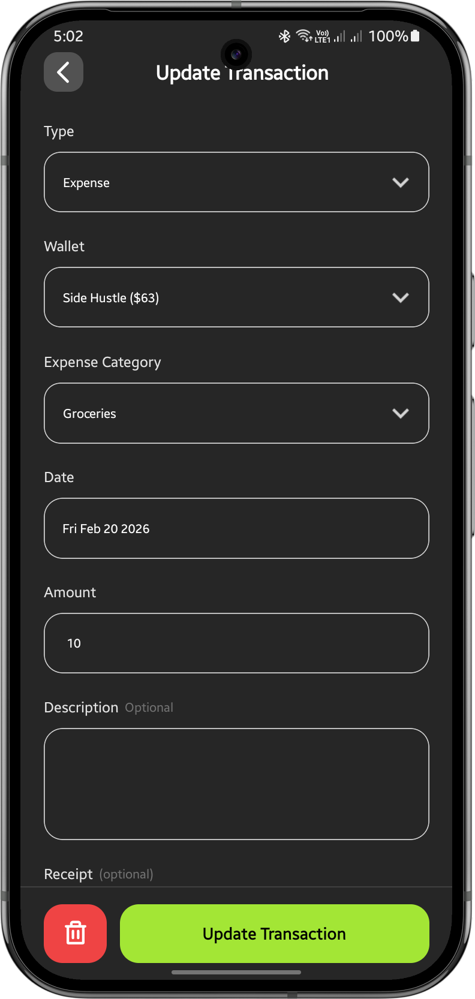
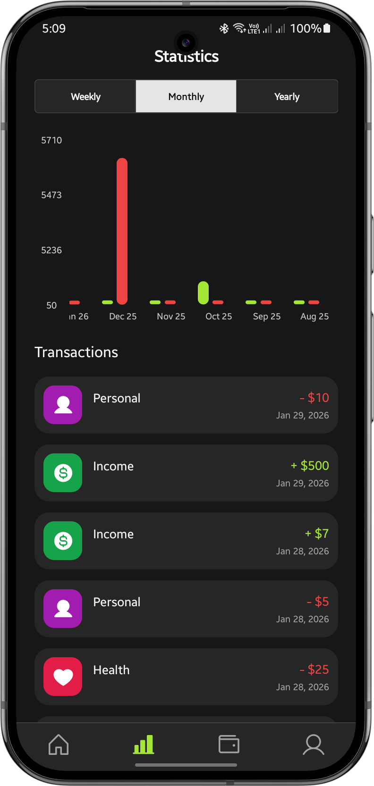
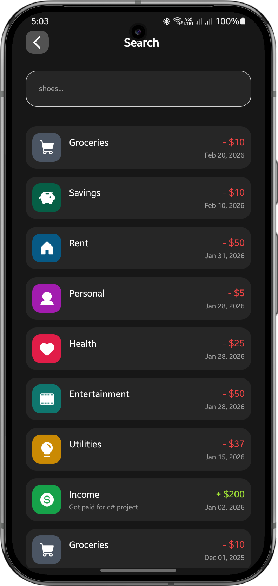

# SpendWise

SpendWise is a personal finance app for tracking income, expenses, and wallets in one place. It provides charts, transaction history, and profile management across Android & iOS.

## 📱 Features

- **User Authentication**: Secure email-based sign-up and login with Firebase Authentication
- **Multi-Wallet Support**: Create and manage multiple wallets for different purposes (e.g., personal, savings, investments)
- **Transaction Management**: Track income and expenses with detailed transaction history
- **Statistics & Analytics**: Visualize spending patterns and financial insights with charts
- **Profile Management**: Manage user profile with avatar upload capability
- **Search Functionality**: Easily find transactions using the search modal (by category or description)
- **Responsive Design**: Works seamlessly on Android & iOS

---

## Screenshots

| Splash Screen | Registration | Home |
| :---: | :---: | :---: |
|  |  |  |

| Profile | Wallets | New Transaction |
| :---: | :---: | :---: |
|  |  |  |

| Update Transaction | Analytics | Search |
| :---: | :---: | :---: |
|  |  |  |

---

## 🛠️ Tech Stack

### Frontend
- **React Native 0.76.5** - Cross-platform mobile development
- **Expo 54.0.32** - Managed React Native framework
- **TypeScript** - Type-safe development
- **Expo Router 6.0** - File-based routing system
- **React Navigation 7.1** - Bottom tab navigation

### UI & Styling
- **React Native Screens** - Native stack navigation support
- **Expo Linear Gradient** - Gradient support
- **Phosphor Icons** - Icon library
- **React Native Gifted Charts** - Data visualization
- **React Native Element Dropdown** - Dropdown components

### Backend & Storage
- **Firebase 12.6.0** - Backend services
  - **Firebase Authentication** - User authentication and session management
  - **Firestore** - Real-time database for storing user data, wallets, and transactions
- **Cloudinary** - Cloud image storage and management
  - Image uploads for profile avatars, Wallet Image, Receipt Image
  - Automatic image optimization and CDN delivery

### Utilities
- **Axios 1.13** - HTTP client for API requests
- **Async Storage** - Local data persistence
- **React Native Date Time Picker** - Date/time selection

## 📁 Project Structure

```
SpendWise/
├── app/                      # App screens and routing
│   ├── (auth)/              # Authentication screens
│   ├── (tabs)/              # Main tab screens (home, wallet, statistics, profile)
│   ├── (modals)/            # Modal screens
│   ├── _layout.tsx          # Root layout
│   └── index.tsx            # Root screen
├── components/              # Reusable components
│   ├── Button.tsx
│   ├── Input.tsx
│   ├── ScreenWrapper.tsx
│   └── ...
├── services/                # API and Firebase services
│   ├── authService.ts
│   ├── transactionService.ts
│   ├── userService.ts
│   ├── walletService.ts
│   └── imageService.ts
├── contexts/                # React Context for state management
│   └── authContext.tsx
├── hooks/                   # Custom React hooks
│   └── useFetchData.ts
├── config/                  # Configuration files
│   └── firebase.ts
├── constants/               # App constants
│   ├── theme.ts            # Color scheme and theme
│   ├── data.ts             # Static data
│   └── index.ts
├── utils/                   # Utility functions
│   ├── common.ts
│   └── styling.ts
├── android/                 # Android-specific configuration
├── assets/                  # Images and icons
├── package.json
├── app.json                # Expo configuration
├── tsconfig.json           # TypeScript configuration
└── README.md               # This file
```

## 🚀 Getting Started

### Prerequisites

- **Node.js** (v18 or higher)
- **npm** or **yarn**
- **Java Development Kit (JDK 21)** for Android development
- **Android SDK** with API level 24 or higher
- **Git**

### Installation

1. Clone the repository:
```bash
git clone <repository-url>
cd SpendWise
```

2. Install dependencies:
```bash
npm install
```

3. Set up environment variables:
Create a `.env` file in the root directory with your Firebase configuration if not already included.

### Running the App

#### Development Mode (Web)
```bash
npm start
# Then press 'w' to open in web browser
```

#### Android
```bash
# For running on Android device/emulator
npm run android
# or
npx expo run:android
```

#### iOS
```bash
# For running on iOS simulator/device
npm run ios
# or
npx expo run:ios
```

## 📝 Available Scripts

| Command | Description |
|---------|-------------|
| `npm start` | Start the Expo development server |
| `npm run android` | Build and run on Android |
| `npm run ios` | Build and run on iOS |
| `npm run web` | Run on web browser |
| `npm run lint` | Run ESLint to check code quality |
| `npm run reset-project` | Reset project to initial state |

## 🔐 Authentication

SpendWise uses Firebase Authentication for secure user management:

- Users can create new accounts with email and password
- Passwords are securely stored and managed by Firebase
- Authentication state persists using AsyncStorage
- Session management is automatic

## 💾 Data Management

All user data is stored in Firebase Firestore:

- **Users Collection**: Stores user profiles and preferences
- **Wallets Collection**: Manages wallet information
- **Transactions Collection**: Records all income and expense transactions

## 🖼️ Image Storage (Cloudinary)

Profile images and avatars are stored on Cloudinary with the following setup:

- **Cloud Name**: `your_cloud_name`
- **Upload Preset**: `your_upload_preset`
- **Folder**: Images organized by user type (e.g., `users/` folder)
- **Features**: Automatic optimization, CDN delivery, responsive image formats

### Cloudinary Configuration

Add the following to your constants folder or create a`.env` file if you want to use different Cloudinary credentials:
```env
EXPO_PUBLIC_CLOUDINARY_CLOUD_NAME=your_cloud_name
EXPO_PUBLIC_CLOUDINARY_UPLOAD_PRESET=your_upload_preset
```

The image upload is handled in [services/imageService.ts](services/imageService.ts) and used throughout the app for profile management.


## 🤝 Contributing

Contributions are welcome! Please follow these steps:

1. Create a new branch for your feature
2. Make your changes
3. Run the linter: `npm run lint`
4. Commit with descriptive messages
5. Push and create a pull request

## 📱 Supported Platforms

- **Android** 7.0 (API 24) and above
- **iOS** 13.0 and above
- **Web** (via Expo Web)

## 🐛 Troubleshooting

### Android Build Issues
- Clear gradle cache: `cd android && ./gradlew clean && cd ..`
- Ensure JAVA_HOME and ANDROID_HOME are set correctly
- Check NDK version compatibility

### Dependencies Issues
- Clear node_modules: `rm -r node_modules && npm install`
- Clear cache: `npm cache clean --force`

### Firebase Connection Issues
- Verify Firebase configuration in `config/firebase.ts`
- Check internet connection
- Ensure Firebase project is properly set up

## 📄 License

This project is licensed under the MIT License - see the LICENSE file for details.

## 👨‍💻 Author

Created by Arslan Ahmed
Developed by: Arslan Ahmed - [arslanahmednaseem@gmail.com](mailto:arslanahmednaseem@gmail.com)  

## 📞 Support

For issues or questions, please create an issue in the repository or contact the development team.

---

**Happy spending wisely! 💰**
