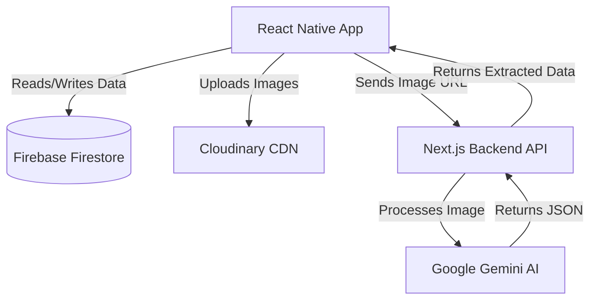

# SpendWise - Professional Project Handover Documentation

This document serves as the comprehensive architectural and operational manual for the SpendWise application. It is designed to assist freelance clients, development teams, and future maintainers in understanding, maintaining, and deploying the software.

---

## 1. Executive Summary

- **Project Name:** SpendWise
- **Purpose:** An AI-powered personal finance application designed to help users track expenses, manage budgets, scan receipts via AI, and receive personalized financial advice.
- **Target Users:** Individuals seeking a modern, automated, and intelligent way to manage their personal cash flow across multiple accounts.
- **Supported Platforms:** Android (APK/AAB) and iOS (IPA) via React Native.
- **Current Development Status:** Version 1.0 (Production-Ready). The core application, AI integration, and external API backend are fully implemented, tested, and ready for app store distribution.

---

## 2. Feature Overview

### Authentication
- **Email/Password:** Secure sign-up and login utilizing Firebase Authentication.
- **Google Single Sign-On (SSO):** One-tap login integration for Android/iOS.
- **Security:** Password strength validation, email format checking, and automated session management.

### Dashboard & Statistics
- **Financial Overview:** Real-time calculation of total balance, income, and expenses.
- **Data Visualization:** Interactive charts and graphs (via React Native Gifted Charts) detailing spending trends over configurable time periods.

### Wallet Management
- **Multi-Wallet Architecture:** Users can create distinct wallets (e.g., Cash, Bank, Crypto).
- **Customization:** Wallets can have custom names, icons (uploaded to Cloudinary), and initial balances.

### Transactions
- **Tracking:** Comprehensive logging of Income, Expenses, and Wallet-to-Wallet Transfers.
- **Metadata:** Transactions include categories, dates, descriptions, and optional receipt images.
- **Search:** Dedicated search interface for filtering transactions by description or category.

### Budgets
- **Monthly Budgeting:** Users can set spending limits per category.
- **Progress Tracking:** Visual indicators showing how much of the budget has been consumed based on real-time transaction data.

### Artificial Intelligence (AI) Features
- **AI Receipt Scanner:** Users upload a photo of a receipt, and the system automatically extracts the total amount, merchant name, and date to instantly draft a transaction.
- **AI Financial Advisor:** An integrated chat interface where users can ask a virtual assistant for budgeting tips and financial analysis.

### Data Export & Settings
- **CSV Export:** Users can download their entire transaction history into a spreadsheet.
- **Dynamic Theming:** Seamless support for Light and Dark modes.
- **Profile Management:** Avatar uploads and user detail modifications.

---

## 3. Technology Stack

### Frontend / Mobile Client
- **Framework:** React Native (0.76.5)
- **Environment:** Expo (54.0.32)
- **Language:** TypeScript
- **Routing:** Expo Router (6.0)
- **UI Libraries:** Phosphor Icons, React Native Gifted Charts

### Backend & Database
- **Database:** Firebase Cloud Firestore (12.6.0)
- **Authentication:** Firebase Auth
- **Media Storage:** Cloudinary (CDN-optimized image delivery)

### AI & External APIs
- **Custom API Backend:** A Next.js (v15) web server deployed on Vercel at `spendwiseapp.tech`.
- **AI Providers:** Google Gemini API (Primary intelligence) and Groq API (High-speed processing fallback).

---

## 4. Project Structure

The codebase utilizes a modern, domain-driven structure within the Expo framework:

```text
SpendWise/
├── app/                  # Expo Router file-based navigation screens
│   ├── (auth)/           # Login, Register, Welcome screens
│   ├── (tabs)/           # Main tab screens (Home, Analytics, AI Chat, Profile)
│   └── (modals)/         # Pop-up interfaces (New Transaction, Settings, Legal)
├── components/           # Reusable UI components (Buttons, Inputs, Typo)
├── config/               # Firebase initialization and environment configuration
├── constants/            # Global theme tokens (colors, spacing, typography)
├── contexts/             # React Context Providers (AuthContext, ThemeContext)
├── services/             # Abstraction layer for external calls (Database, Image Upload)
├── __tests__/            # Jest unit tests for service logic
├── android/              # Generated native Android code (do not modify manually)
└── ios/                  # Generated native iOS code (do not modify manually)
```

---

## 5. Architecture Overview

### Application Architecture
SpendWise employs a **Client-Server-Backend** hybrid model. The mobile client (React Native) connects directly to Firebase for database state, but relies on a separate Next.js API for complex AI tasks to prevent exposing secure AI API keys inside the mobile app bundle.

### State Management
State is managed hierarchically using React Context:
1. `AuthContext`: Monitors Firebase session state globally.
2. `ThemeContext`: Monitors user preference and system scheme.
3. **Local State:** Component-level state is handled via standard React Hooks (`useState`, `useRef`).

### Mermaid Diagram: Data Flow



---

## 6. Firebase Configuration

- **Authentication:** Configured to accept Email/Password and Google providers.
- **Firestore Collections:**
  - `users`: User metadata, theme preferences.
  - `wallets`: Financial containers linked to a specific `uid`.
  - `transactions`: Individual financial events linked to a `uid` and a `walletId`.
  - `budgets`: Monthly spending limits linked to a `uid`.
- **Security Rules:** Firestore rules are strictly bound to authentication. A user can only read, write, update, or delete a document if `request.auth.uid == resource.data.uid`.

---

## 7. Environment Variables

The `.env` file in the root of the mobile project requires the following keys:

| Variable | Required | Purpose | Example |
|---|---|---|---|
| `EXPO_PUBLIC_FIREBASE_API_KEY` | Yes | Authenticates Firebase SDK requests | `AIzaSyB...` |
| `EXPO_PUBLIC_FIREBASE_AUTH_DOMAIN` | Yes | Firebase auth routing domain | `spendwise-prod.firebaseapp.com` |
| `EXPO_PUBLIC_FIREBASE_PROJECT_ID` | Yes | Unique Firebase project identifier | `spendwise-prod` |
| `EXPO_PUBLIC_FIREBASE_STORAGE_BUCKET` | No | Firebase storage bucket (unused) | `spendwise.appspot.com` |
| `EXPO_PUBLIC_FIREBASE_MESSAGING_SENDER_ID` | Yes | Push notification routing | `1234567890` |
| `EXPO_PUBLIC_FIREBASE_APP_ID` | Yes | Platform-specific Firebase app ID | `1:123:android:abc` |
| `EXPO_PUBLIC_FIREBASE_GOOGLE_CLIENT_ID` | No | Enables Google SSO login | `123-abc.apps.googleusercontent.com` |
| `EXPO_PUBLIC_API_URL` | Yes | The URL of the Next.js AI backend | `https://spendwiseapp.tech/api` |
| `EXPO_PUBLIC_CLOUDINARY_CLOUD_NAME` | Yes | Cloudinary account identifier | `dvxkqbc` |
| `EXPO_PUBLIC_CLOUDINARY_UPLOAD_PRESET` | Yes | Cloudinary unsigned upload configuration | `spendwise_preset` |

---

## 8. External Services

1. **Firebase:** Acts as the primary backend-as-a-service (BaaS), handling secure user sessions and real-time database synchronization.
2. **Cloudinary:** Used exclusively for media hosting. When a user uploads a receipt, it bypasses Firebase and goes directly to Cloudinary for instant CDN distribution and heavy image compression.
3. **SpendWise Web (Next.js):** Acts as the middleman for AI processing. The mobile app sends the Cloudinary receipt URL to `https://spendwiseapp.tech/api/ai-receipt`, which securely contacts Google Gemini to extract data without putting Google API keys in the mobile binary.

---

## 9. Build & Deployment

### Development Workflow
Start the local development server:
```bash
npx expo start --clear
```

### Expo Application Services (EAS) Build
To build the application entirely in the cloud without needing Android Studio or Xcode:

**Android Production Build (AAB/APK):**
```bash
eas build -p android --profile production
```

**iOS Production Build (IPA):**
```bash
eas build -p ios --profile production
```

### Local Build (Android)
If a local compilation is required, ensure JDK 21 and the Android SDK are installed:
```bash
cd android
./gradlew assembleRelease # Generates an APK
./gradlew bundleRelease   # Generates an AAB for the Play Store
```

---

## 10. Maintenance Guide

- **Updating Dependencies:** The project relies heavily on Expo. To update packages safely to versions compatible with the current Expo SDK, run: `npx expo install --fix`.
- **Database Maintenance:** No manual schema migrations are required for Firestore (NoSQL). If the data model changes, simply update the TypeScript interfaces in the `types` directory.
- **API Key Rotation:** If any keys are compromised, regenerate them in their respective portals (Firebase Console, Cloudinary Dashboard) and update the `.env` file and EAS Secret variables.

---

## 11. Ownership Transfer Checklist

When handing this project over to a client or new engineering team, ensure the following accounts and credentials are fully transferred:

- [ ] **GitHub Repositories:** Transfer ownership of both `spendwise-react-native` and `spendwise-web`.
- [ ] **Firebase Console:** Add the new owner's email as an "Owner" in IAM and remove yourself.
- [ ] **Cloudinary Account:** Transfer login credentials or change the billing email.
- [ ] **Vercel Account:** Transfer the `spendwise-web` project to the client's Vercel team.
- [ ] **Domain Registrar (`get.tech`):** Transfer the `spendwiseapp.tech` domain name ownership.
- [ ] **Google Play Console / Apple Developer Account:** Upload the app to the client's respective developer portals.
- [ ] **Google Cloud Platform:** Transfer the project containing the Gemini API key.
- [ ] **Environment Variables:** Provide the client with a secure `.env` file via a secret manager.

---

## 12. Known Limitations

- **Offline Mode:** The application relies on Firebase's built-in offline caching. If a user deletes the app cache, they cannot view transactions until they reconnect to the internet.
- **AI Processing Time:** Extracting data from complex, crumpled receipts via the AI endpoint can take 3-6 seconds.
- **Google SSO Limitations:** Google Sign-in requires native configuration and will fail inside the standard "Expo Go" development app; it must be tested on a compiled development build or production build.

---

## 13. Future Roadmap

- **Plaid Integration:** Allow users to securely connect their real bank accounts for automated transaction syncing.
- **Collaborative Wallets:** Allow multiple users (e.g., spouses) to share and view a single wallet.
- **Web Dashboard:** Expand the Next.js marketing site into a full desktop dashboard where users can log in and view their finances on a larger screen.
- **Premium Tier:** Introduce a subscription model utilizing RevenueCat to unlock advanced AI insights and unlimited receipt scans.

---

## 14. Appendix

### Useful Commands
- `npm run lint`: Runs ESLint to check for code quality and syntax errors.
- `npm run test`: Executes the Jest testing suite for the internal services.
- `npx expo prebuild --clean`: Wipes the `/android` and `/ios` folders and completely regenerates the native code based on the `app.json` configuration.

### Important Configuration Files
- `app.json`: The core Expo configuration file controlling the app name, bundle identifier (`com.spendwise.app`), icons, and splash screens.
- `firestore.rules`: Contains the production security rules for the database.
- `package.json`: Contains all dependencies and custom NPM scripts.

---
*Generated by Arslan Ahmed on June 30, 2026. Review all deployment keys and store listing assets before final production release.*
